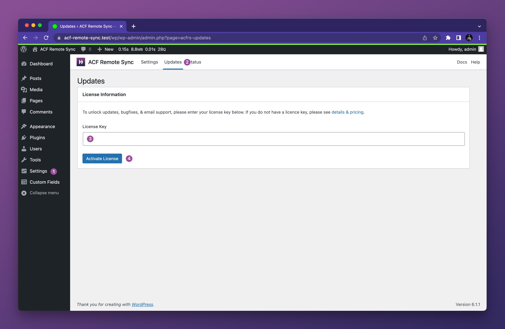

# Installing and activating the plugin

1. Download the plugin zip file from your [Hookturn account page](https://hookturn.io/account).
2. Head to the plugins area of your website – **WP Admin > Plugins > Add New** – and upload the file.
3. Activate the plugin.

## Activating the license

In order to receive new features, bugfixes, and support, you must activate the license key on the site. To do this;

1. Head to the plugin settings page – **WP Admin > Settings > ACF Remote Sync**.
2. Click the **Updates** link in the settings header.
3. Enter your license key.
4. Click the **Activate License** button.

