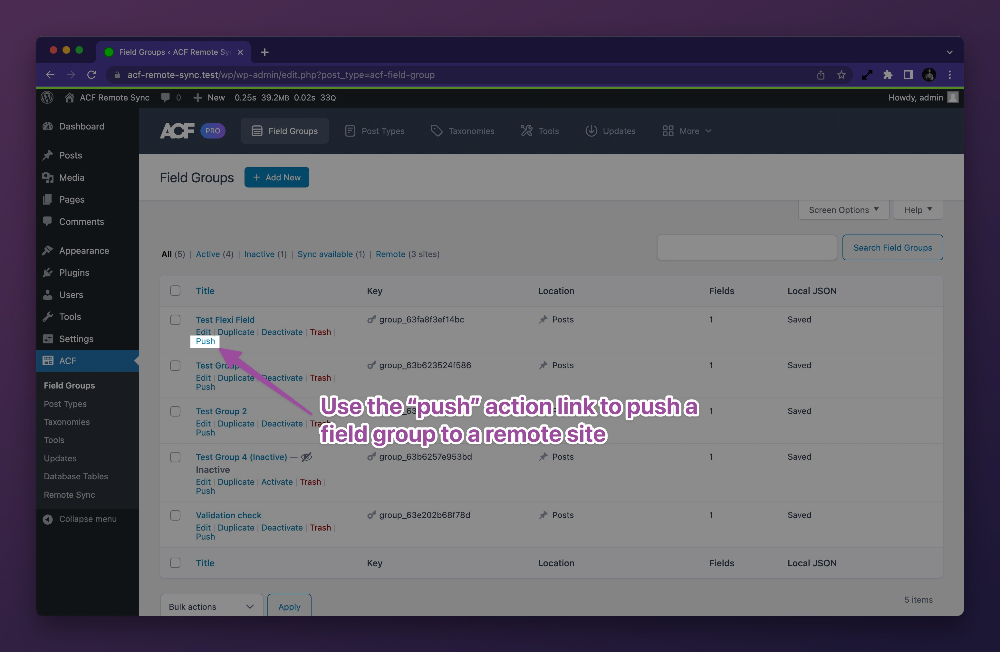
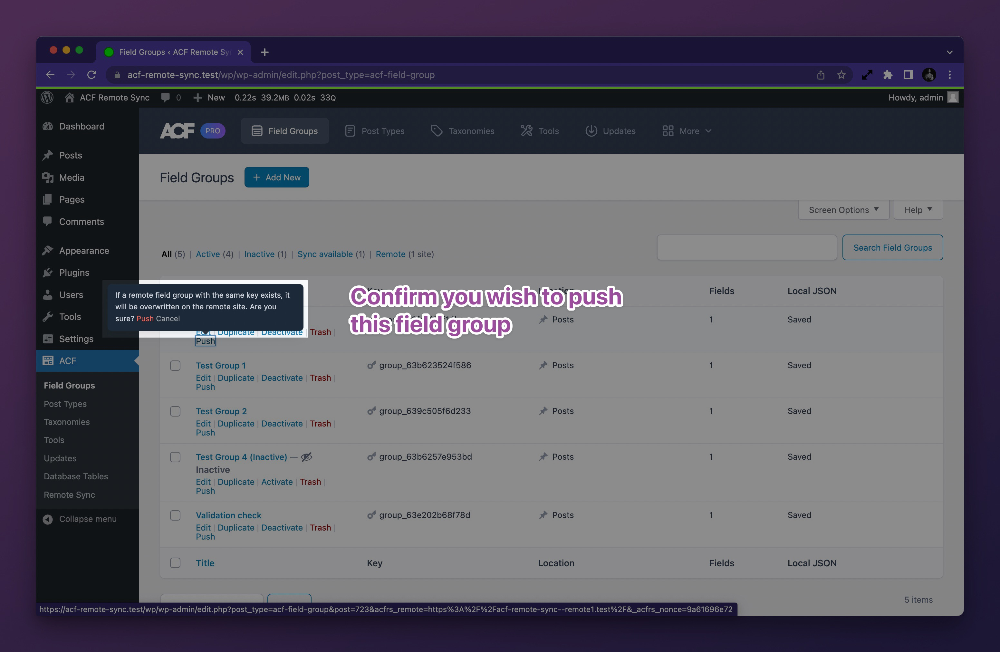
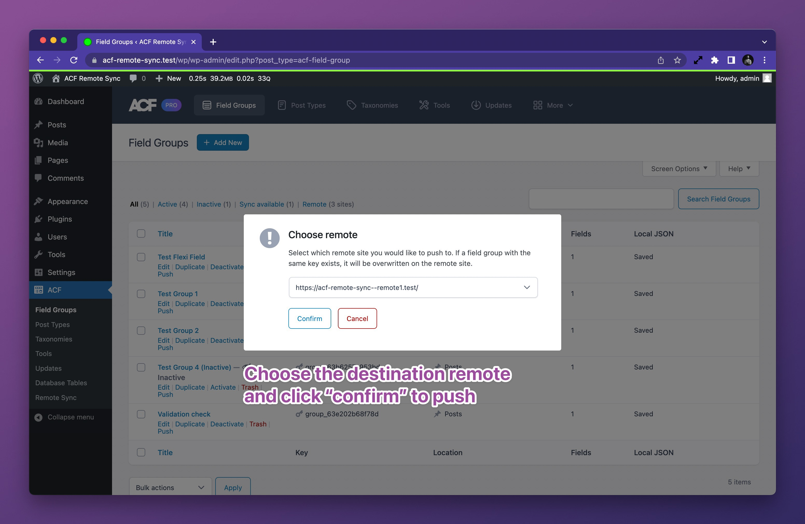
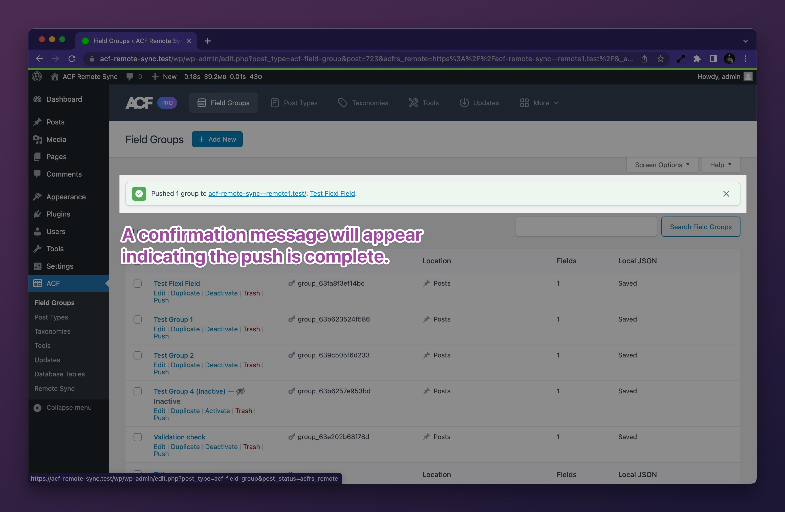
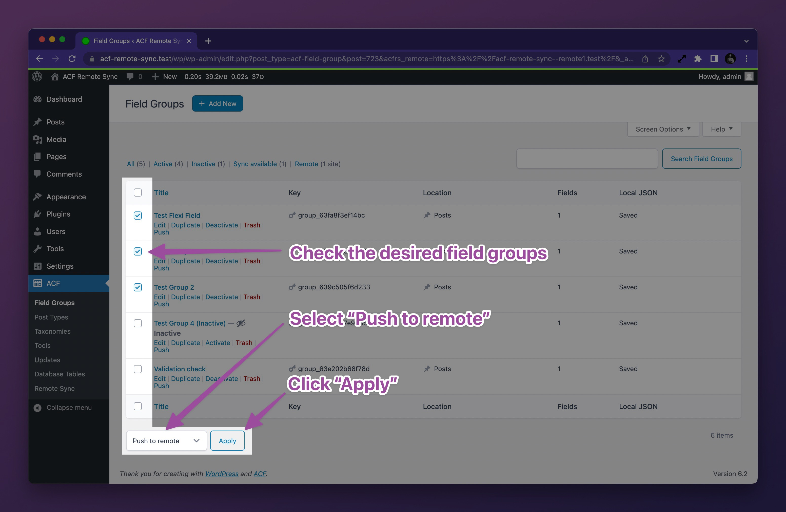
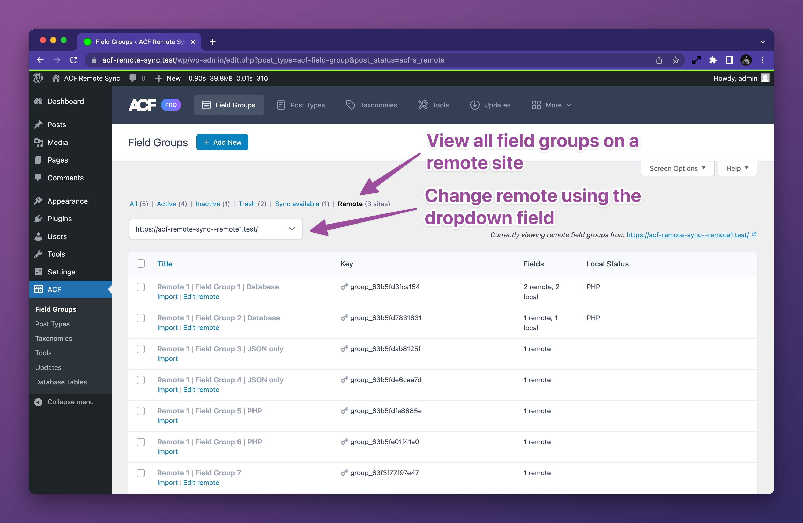
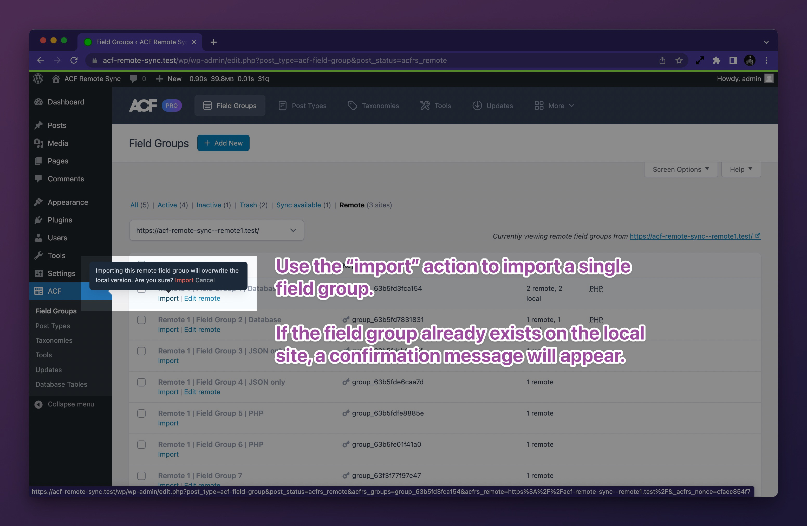
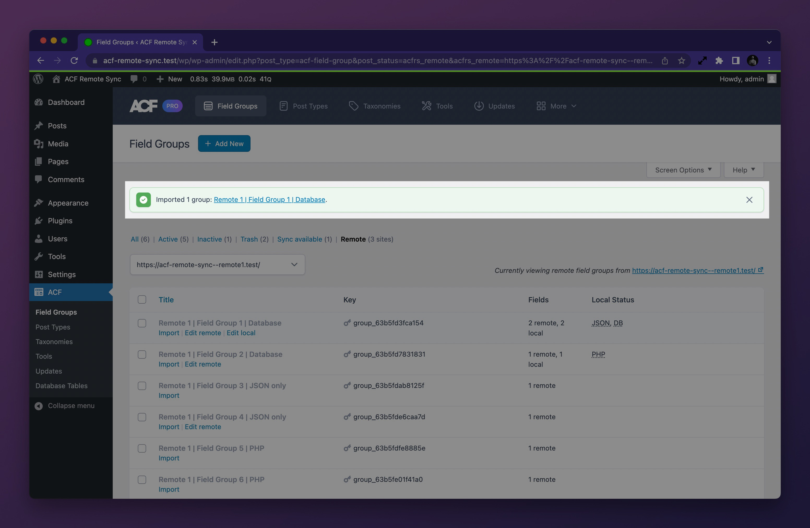
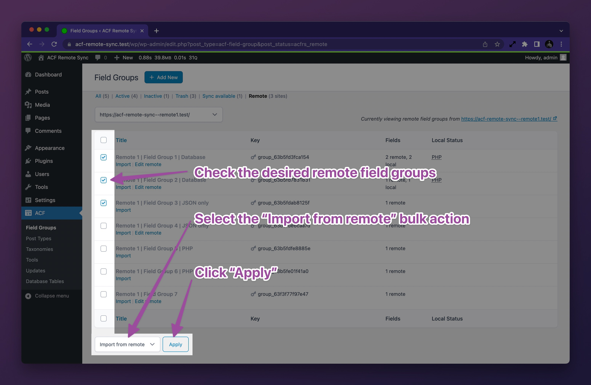

# Moving field groups between sites

Once you have one or more remote sites [connected to your local site](Connecting%20your%20first%20remote%20site.md), you
may start pushing and pulling field groups between the remote sites and your local site.

## Pushing a field group to a remote site

In the WordPress admin, navigate to the **ACF > Field Groups** list screen and locate the field group you wish to push.
Click the **push** action link to initiate the push.

If you have a single remote site set up, you will see a simple inline confirmation prompt. Click **Push** to confirm.

If you have multiple remote sites set up, you will see a modal dialog with a list of your remote sites. Select the
remote site you wish to push the field group to and click **Confirm** to confirm.

The field group will be pushed to the remote site and a confirmation message will be displayed. The message contains
direct links which may be used to naviate to the remote site's front page or directly to the field group edit screen on
the remote site.

### Pushing multiple field groups at once

You may push more than one field group at a time using the **Bulk action** dropdown. Check the field groups you wish to
push and choose the **Push to remote** bulk action from the dropdown, then click **Apply**. A confirmation or a remote
selection prompt will appear for actioning as when pushing a single field group.

## Pulling a field group from a remote site

In the WordPress admin, navigate to the **ACF > Field Groups** list screen and click the **Remote** view link. This will
show you a list of field groups from the first remote site you have set up. If you have multiple remote sites set up,
you may switch between remotes using the dropdown at the top of the list.

Locate the field group you wish to pull and click the **import** action link to initiate the pull. If a field groups
with the same key already exists on the local site, a confirmation prompt will appear.

A confirmation message will be displayed. The message contains direct links to the imported field groups' edit screen,
should you wish to make any changes.

### Pulling multiple field groups at once

You may pull more than one remote field group at a time using the **Bulk action** dropdown. Check the remote field
groups you wish to import, choose the **Import from remote** bulk action, then click **Apply**. If any of the checked
remote field groups keys already exist on the current site, a confirmation prompt will be shown.

